inleiding :
===========

Het is de bedoeling dat je als gebruiker een object kan optillen m.b.h.v. een
robotarm. Om deze objecten te detecteren wordt gebruik gemaakt van een Intel
Realsense. Deze Intel Realsense zal hierna de gedetecteerde objecten doorsturen
naar de robotarm.

Door gebruik te maken van de Microsoft Hololens 1 kunnen we hierbij nog user
input bij doen. De user input wordt verwerkt door de Hololens en zullen dan
doorgestuurd worden naar de robotarm om dan zo met het juiste object de correcte
actie uit te voeren (bv: verplaatsen van het object naar een door de gebruiker
gekozen locatie.

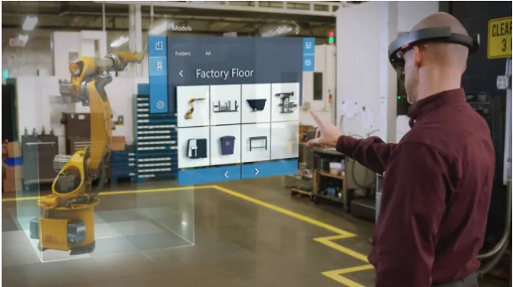

Wat:
====

Er wordt gebruik gemaakt van de Microsoft Hololens 1. Dit device (mixed reality
bril) kan hologrammen projecteren op de glazen van de bril. Deze hologrammen
worden geprojecteerd bovenop de echte wereld, dit betekent dat de gebruiker de
echte wereld nog kan blijven zien en dat de hologrammen reageren op de wereld
waarin de gebruiker zich bevindt. De gebruiker kan ook interacties aangaan met
de hologrammen door ze aan te tikken, verslepen, … . Dit is het concept van
mixed reality.

In dit project heeft de hololens enkele basisfeatures gebruikt:

1.  **Gesture manager:** Deze feature van de Hololens analyseert handbewegingen
    en zal nagaan of deze een bepaalde input betekenis hebben, deze
    handbewegingen zijn airtab, bloom en gaze.

    

2.  **Spatial mapping:** Via spatial mapping wordt een digitale 3D kaart van de
    omgeving gegenereert. Dit geeft de gebruiker de vrijheid om hologrammen te
    plaatsen op objecten en elementen uit de reële wereld bv: (tafels, vloer en
    stoelen). Deze kaart blijft statisch en wordt geüpdatet door de Hololens en
    heeft een eigen coördinatenstelsel dat ook statisch wordt bijgehouden.

    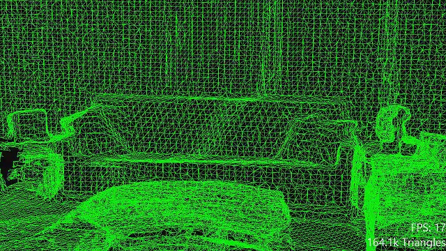

3.  **Voice Input:** Via de microfoon van de Hololens kan ook voice input
    opgenomen worden die dan verwerkt wordt door de beschikbare voice input
    library in de Hololens. Indien de gebruiker ervoor kiest om deze in te
    schakelen kunnen er keywords worden ingesteld met een bepaalde functie.
    Indien deze keywords dan worden uitgesproken zal de Hololens hierop
    reageren.

Hoe:
====

Het programmeren van de Hololens is gebeurt in Unity 2017.4.20 met gebruik van
Visual Studio 2017 (c\# als programmeertaal).

Voor een handige beginnerscursus programmeren voor de Hololens zie:
<https://docs.microsoft.com/en-gb/windows/mixed-reality/holograms-101>

In de volgende delen zal er stapgewijs besproken worden wat er wanneer gedaan
is.

Deel 1 basis (marker met draai animatie boven object)
-----------------------------------------------------

1.  In de eerste stap ben ik begonnen met de implementatie van een cursor. In
    unity is deze cursor een 3D object dat gebruik maakt van het script
    ‘Worldcursor’. Dit script zent een Raycast uit indien er een object geraakt
    wordt. De cursor zal hierna automatisch worden verplaatst naar de locatie
    van de Raycast intersectie. Een extra feature van dit script is dat het de
    draairichting van de cursor regelt. Dit wilt dus zeggen dat de cursor door
    dit script zich mee op de oppervlakte van het object zal bevinden.

2.  Implementatie van de spatial mapping d.m.v. een object dat voorzien wordt
    door Microsoft in de vorm van een script.

3.  Hierna is er begonnen aan de implementatie van de air-tab op de cursor. De
    implementatie hiervan gebeurt door code bij te voegen in het eerder
    gebruikte ‘Worldcursor’ script. In deze code zal een nieuwe
    gestureRecognizer worden aangemaakt waarna er automatisch gekeken zal worden
    naar eventuele gestures van de gebruiker. Indien een gesture van de
    gebruiker herkent wordt dan zal dit automatisch een event triggeren en de
    hierbij horende code uitvoeren.

    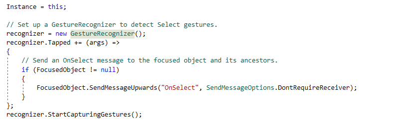

4.  Eens de gesturemanager geconfigureerd is wordt ervoor gezorgd dat de
    coördinaten verkregen kunnen worden van de cursor indien er een airtab
    gedetecteerd wordt. Deze coördinaten zullen na detectie van de airtab gelogd
    worden door het programma.

   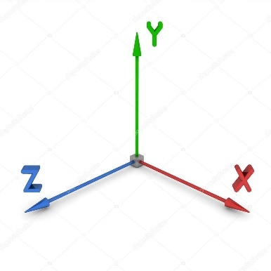

    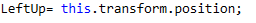

    Dit is een voorbeeld van de xyz oriëntatie van de Hololens. Er wordt door de
    code een 3D vector teruggegeven. Zo worden er een aantal metingen gedaan om
    te bepalen of de coördinaten moeten veranderen mocht de gebruiker een
    beweging hebben gedaan, maar terug zijn gekeerd naar zijn originele locatie.

    Om dit te testen hebben we enkele metingen uitgevoerd:

    -   **Meting 1:** Meten van een vlak om te bepalen hoe accuraat de metingen
        van de Hololens zijn:

        *Punt 1:* (-0.4, -0.2, 0.8)

        *Punt 2:* (-1.7, -0.2, 1.5)

        *Punt 3:* (-0.8, -0.2, 1.8)

        *Punt 4:* (-1.4, -0.2, 0.5)

    -   **Meting 2:** Meten van een positie nadat de gebruiker in een afgesloten
        ruimte heeft rondgewandeld:

        *Meetpositie 1:* (0.4, -0.7, 1.2)

        *Meetpositie 2:* (0.1, -0.7, -3.7)

        *Meetpositie 3:* (0.4, -0.7, 1.2)

        Positie 1 is het referentiepunt van deze metingen.

        Positie 2 bevindt zich op 3 meter afstand van de eerste meting

        Positie 3 is de meting terug op het referentiepunt na het terugkeren van
        de 2e positie

5.  Na het bepalen van de foutmarge op de coördinaten en we deze eerder
    beschikbaar hebben gemaakt in het systeem d.m.v. een log kunnen we deze nu
    gebruiken om een algoritme te genereren. Dit algoritme zal bepalen waar de
    gebruiker een object naartoe wilt laten verplaatsen. Door telkens op de
    linkse en rechtse bovenhoek van de bodemplaat 2 airtabs uit te voeren kunnen
    de lengte en de hoogte berekend worden. Met deze gegevens kunnen we dan
    berekenen waar het blokje gegenereerd zal worden indien we een percentage
    krijgen van de afstand tegenover de linkse bovenhoek van de bodemplaat.

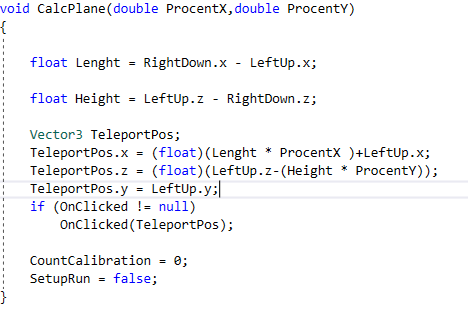

1.  Wanneer het algoritme is uitgevoerd en de locatie berekend is zal deze
    vector doorgestuurd worden naar het hologram. Dit hologram zal dan de
    locatie aanduiden van het object in zijn omgeving. Dit wordt gedaan door
    communicatie met behulp van delegates tussen het script van de cursor en dat
    van de hologram.

    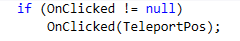

    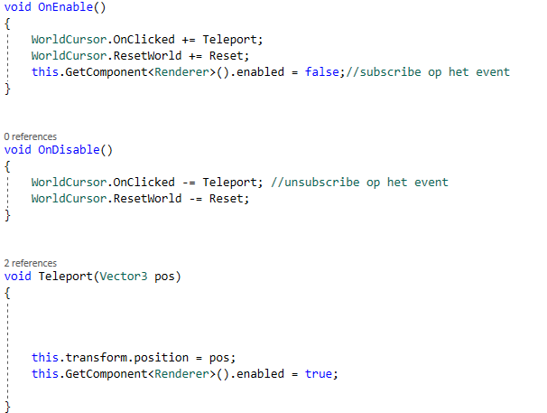

    Wanneer deze vector verkregen wordt door de delegate zal de positie van het
    object omzetten naar de positie van de hologram.

2.  Bij het aanduiden van de meest linkse en rechtse hoek van de bodemplaat en
    andere objecten wordt er gebruik gemaakt van een speciale marker. Deze
    markers worden geplaatst op de locaties van de airtab. Op deze manier krijgt
    de gebruiker feedback over de door hem aangeduide locaties. Deze markers
    worden op dezelfde manier als in stap 6 doorgegeven naar de locatie van de
    airtab.

    De gebruiker moet 2x de airtab functie gebruiken om deze modus te
    beëindigen.

    

3.  Indien de gebruiker opnieuw wenst te beginnen met het plaatsen van de
    markers kan dit gedaan worden door het voice commando ‘reset’ uit te
    spreken. Voor dit voice commando is een specifieke delegate aangemaakt
    waarop alle scripts reageren en automatisch zichzelf resetten.

    -   Om een voice commando aan te maken moet men een keywordRecognizer
        aanmaken en hieraan een methode te koppelen waarin de gevraagde actie(s)
        worden uitgevoerd. In dit geval zal dan de code worden aangeroepen die
        door de delegate gevraagd werd:

        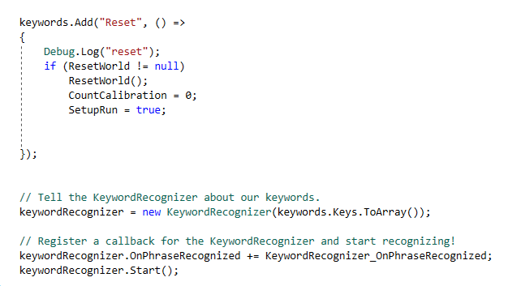

        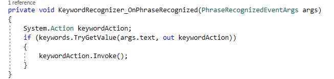

4.  Om de configuratie voor de gebruiker te vergemakkelijken wordt er een
    textfield vastgehangen aan de main camera. In dit textfield worden de
    coördinaten van de airtabs weergegeven en waar de gebruiker zich op dat
    moment in de configuratie bevindt.

Deel 2 multiple objects and user experience
-------------------------------------------

1.  Om de gebruiksvriendelijkheid voor de gebruiker te verbeteren is er als
    eerste een menu structuur geïmplementeerd op de markers. Dit menu bevat 4
    submenu’s (back, point to object, pick up and grab, pick up and grab and
    wait). Voor de gebruiker worden deze menu’s getoond d.m.v. een animatie.

   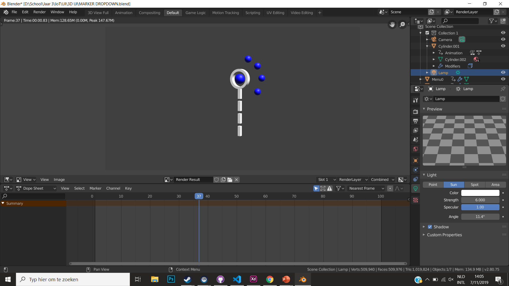

   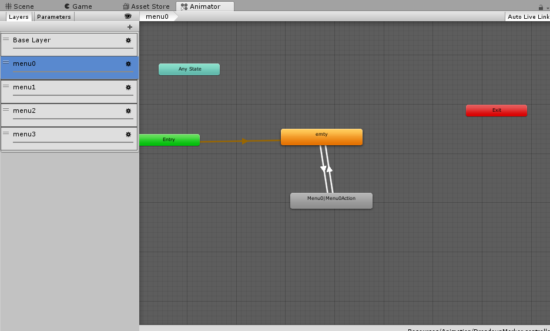

   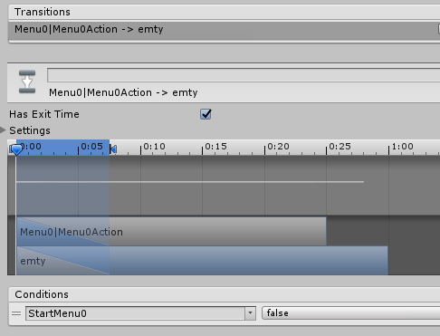

    Om de animatie te starten wordt er in Unity gebruik gemaakt van een
    animatiecontroller. Zoals dat op de afbeelding hiernaast op te merken valt
    bestaat de animatie uit meerdere layers. Elk van deze layers staat in voor
    de creatie van een aparte sphere of submenu van de marker. Voordat er een
    animatie gestart kan worden moet er een state aangemaakt worden. Iedere
    state wordt gestart door een transitie. Aan deze transities kan er telkens
    weer een variabele gelinkt worden die aangesproken wordt in een script om zo
    de animatie op te starten.

    StarMenu0 is de boolean variabele die door elke animatie wordt gestart in de
    scene.

2.  Na het beschikbaar maken van de animatie op de marker heeft dit heet
    voordeel dat de touch events ineens gelinkt zijn op de individuele
    submenu’s. In latere iteraties zullen deze events worden gebruikt om data
    terug te sturen naar de computer (welke actie op welke marker geselecteerd
    is).

    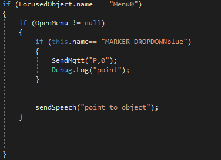

   

3.  Voor dit project moest er eigenlijk gebruik gemaakt worden van meerdere
    markers. Dit zodat de gebruiker de mogelijkheid heeft om meerdere objecten
    te detecteren indien nodig. Om dit te bewerkstelligen zijn er meerdere
    marker objecten toegevoegd aan de omgeving door de oude marker te kopiëren.
    Deze markers zijn hierna hernoemt en veranderd van kleur. Dit laatste is
    mogelijk door het materiaal van de markers aan te passen.

    Bij het aanmaken van de markers is het noodzakelijk dat we rekening houden
    met schaalbaarheid, dit omdat er niet altijd dezelfde hoeveelheid objecten
    gedetecteerd zullen moeten worden. Momenteel gebruiken we “slechts” 4
    markers maar in latere iteraties zullen dit er meer zijn.

    Om te bepalen hoeveel markers nodig zijn in een sessie kijkt het programma
    naar bepaalde mqtt berichten. Het programma zal in deze berichten op zoek
    gaan naar “;” en zal telkens wanneer dit symbool gevonden wordt een teller
    verhogen.

    Met het resultaat van de telling zal er eens het volledige bericht gelezen
    is een 2D array worden aangemaakt. Er zullen rijen aangemaakt worden tot er
    evenveel rijen zijn als het getal van de teller. Voor de kolommen zijn er
    slechts 2 aanwezig in de array, dit doordat er enkel de procenten van de x
    en z coördinaten in moeten worden opgeslagen.

    Het originele mqtt bericht is een string en om hieruit de juiste waardes te
    halen gebruiken we de parsing methode.

    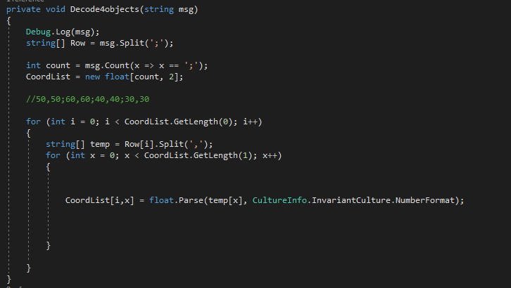

    Hierna zal de 2D array worden doorgestuurd naar de makercontroller. Hieruit
    kan het programma dan de positie van de marker berekenen.

  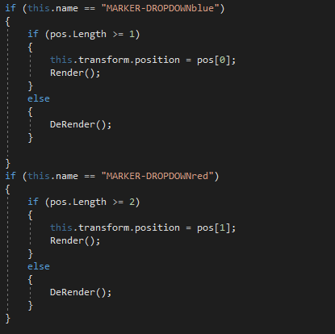

    De markers hebben een animatiecontroller die de animaties van de vorige
    stappen implementeert.

4.  Uit user feedback bleek dat het voor de gebruikers handig zou zijn indien er
    een voice assistant aanwezig zou zijn die hen begeleidt in het gebruik van
    de Hololens. Hiervoor is gebruik gemaakt van de Holotoolkit, deze kan
    verkregen worden via de volgende link:
    <https://github.com/Microsoft/MixedRealityToolkit-Unity/releases/tag/2017.2.1.3>

    Hier is uiteraard ook een tutorial voor beschikbaar, deze kan gevonden
    worden via de volgende link:
    <https://codeholo.com/2018/04/12/texttospeech-tutorial-hololens/>

    Bij dit script, dat gekoppeld is aan de camera, wordt gebruik gemaakt van
    delegates. Op deze manier kunnen andere scripts deze text to speech ook
    gebruiken.

    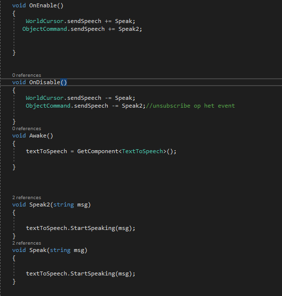

    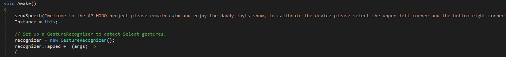

Waarom :
========

Het is in een praktische toepassing nodig dat de gebruiker kan aangeven welk
object hij wil opnemen met de robotarm. Dit hebben we voor dit project
gerealiseerd door gebruik te maken van de Hololens. Op deze manier krijgt de
gebruiker op een eenvoudige en intuïtieve manier feedback en simulaties te zien.

Voor deze opdracht is besloten om een configuratie modus in de Hololens te
voorzien om op deze manier het werkveld te bepalen. Dit leek noodzakelijk daar
de Hololens niet foutloos objecten kan herkennen. Een latere uitbreiding hierop
zou kunnen zijn dat er in de configuratie vermeden kan worden dat er gebruik
moet worden gemaakt van airtabs op de hoekpunten. Deze airtabs zouden dan
vervangen kunnen worden door markers die automatisch de hoekpunten van het
werkveld herkennen en het ineens genereren.
