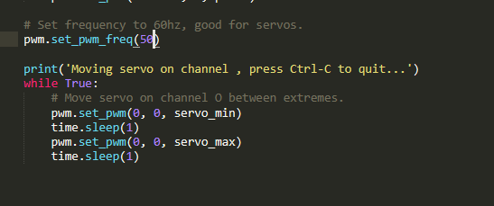
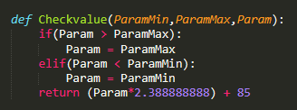
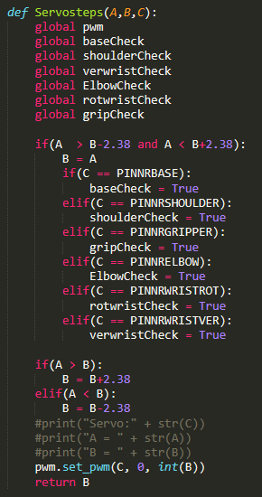
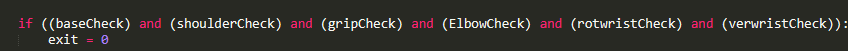
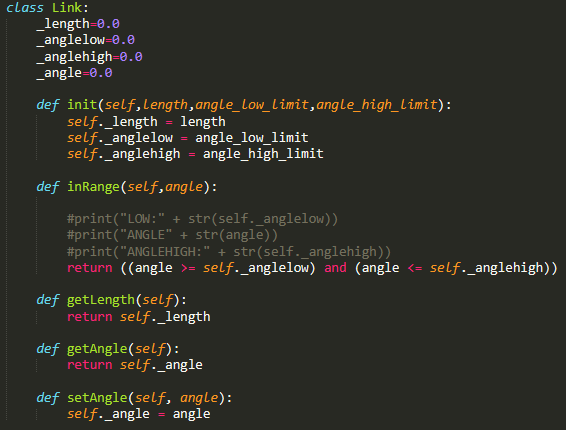
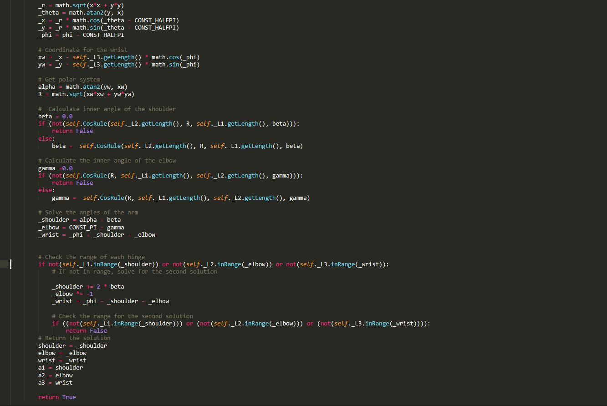

Documentatie Braccio Arm
========================

Inleiding
---------

Ons hele project is gebaseerd op een robot arm die via de hololens objecten moet
kunnen verplaatsen via de commando’s die de gebruiker geeft. Dit hele ding heeft
natuurlijk wel een robot arm nodig. Voor ons project gebruiken we nu de Braccio
Arduino robot arm maar in realiteit is het mogelijk om eender welke arm
gebaseerd op servo’s hier voor te gebruiken.

Wat?
----

De Braccio robot Arm is een klein setje dat wordt verkocht door Arduino zelf.
Dit setje bevat een aantal componenten :

-   De plastic componenten voor de arm te maken

-   6 Servo motoren die we moeten aansturen om de arm te bewegen

-   Een arduino hat voor de servo’s aan te sturen

-   Voedings kabel voor de shield

-   USB kabel voor de arduino

Via dit setje en 2 simpele Arduino libraries is het mogelijk deze al op
coordinaten te baseren en konden we al een basis versie maken.

De Arduino libraries hiervoor zijn :

-   Braccio (simpel te vinden via de Arduino library manager)

-   InverseK (te vinden op github)

Als latere doel hebben wij besloten dat we graag alles via onze Raspberry-Pi
willen doen van aansturing, dit hebben we bereikt door de libraries van Arduino
om te zetten naar Python en via een PCA9685 Servo driver elke servo aan te
sturen in plaats van via de arduino hat.

Hoe?
----

### Aansturing servo’s

Omdat we in onze finale versie willen aansturen via de Raspberry-Pi ga ik hier
ook onze eigen library code beschrijven die is omgezet van de arduino library,
deze komt op hetzelfde neer.

De servo motoren in dit setje nemen enkel heel specifieke PWM waardes aan, een
te grote PWM geeft geen reactie net zoals een te kleine PWM.

Hieronder is het maximale en minimale signaal van de servo’s zichtbaar (via de
servo hat).

De frequentie staat op 50Hz wat dus een periode geeft van 20ms.

Om de servo motoren op hun maximum te zetten moet men de duty cycle 12% van de
periode positief instellen en 88% negatief dus zou deze 2,4ms hoog moeten zijn
en 17,6ms laag.

Om de servo motoren op hun minimum te zetten moet men de duty cycle voor 3% op
positief instellen en 97% negatief dus 0,6ms positief en 19,4ms negatief

Dit zorgt ervoor dat we dus binnen deze waardes van de periode moeten blijven en
dus moeten werken tussen de 0,6ms en 2,4ms om de servo’s te laten werken.

Onze PCA9685 kan perfect tussen deze waardes werken.

Door onze PCA9685 library zijn werk frequentie ook in te stellen of 50Hz ipv de
basis 60Hz en door te weten dat de PCA9685 zijn minimum 0 is en zijn maximum
4096 is kunnen we berekenen hoeveel we moeten doorgeven om tussen die 0,6 en
2,4ms te blijven.

0 = 0ms

4096 = 20ms

409,6 = 2ms

409,6/2 = 204,8 = 1ms

20,48 = 0,1ms

20,48\*6 = 122,88 = 0,6ms

409,6 + 4\*20,48 = 491,52 = 2,4ms

De maximum waardes voor de PCA is 491,52 terwijl het minimum 122,88 is, zolang
we tussen de waardes sturen zullen de PWM’s compatibel zijn voor de servo
motoren en kunnen we dus de servo motoren aansturen via de Raspberry-Pi. Om deze
dan allemaal aan te sturen heb ik de library van de Arduino omgezet en
getweaked.

Dit roepen we aan om de servo motoren te laten bewegen. De variablen geven een
hoek tussen 0 en 180 graden weer net zoals kracht en hoek.

Eerst kijken we na of de waardes die we doorsturen naar de servo motoren wel
degelijk aanvaardbaar zijn voor de servo motoren, we mogen natuurlijk niet hoger
dan 180 gaan of lager dan 0 bij een servo. Dit kijken we dus na en de waarde
wordt dan omgezet naar de waardes die we kunnen doorsturen naar de PCA9685.

Hierna veranderen we stap voor stap de waardes van de servo motoren. Deze kijkt
eerst na of hij op dit moment hoger of lager staat dan de gewilde waarde en zal
afhankelijk hiervan nakijken of deze moet opgeteld worden of afgeteld. Indien
deze waardes gelijk staan wordt een boolean op true gezet die aangeeft dat de
servo correct staan, indien deze allemaal correct staan kan hij opnieuw waardes
krijgen en wordt de code gewoon herhaalt.

### Berekening van de coordinaten

Onze servo motoren aansturen is maar het halve werk, de coordinaten berekenen is
het andere deel. Dit deel verkrijgen we door de Arduino library om te zetten
naar Python en dan ook weer te tweaken zodat deze voldoet aan onze eisen.

Deze library bevat 2 classes :

De **Link** class representeert de verbinding tussen de servo motoren, hierin
wordt bv bijgehouden op welke hoek hij op dat moment staat en hoe lang de
verbinding is tussen deze motoren. Dit is nodig voor de berekeningen.

De **Inverse** class dient om al deze links samen te voegen en al onze
wiskundige logica bij te houden, hierin worden alle berekeningen gedaan. (foto
hieronder is maar een klein deel van deze classe)

Om te beginnen in deze library maken we natuurlijk eerst de classes hun
variables aan, onze arm bestaat uit 4 delen dus maken we ook 4 keer een Link aan
die we hierna binden aan onze inverseK library.

Na het initializeren kunnen we de kijken of de coordinaten mogelijk zijn via
onze library door het volgende lijntje code.

Deze verwijst dus door naar het begin van onze InverseK library en zal een
boolean terug geven indien deze coordinaten mogelijk zijn en de variables A0
t.e.m A3 op de juiste waardes zetten.

Het eerste deel van de library zal nakijken naar welke positie de base van de
arm moet draaien om in het juiste kwadrant te staan en van hieruit verder gaan
naar de volgende berekekingen.

Hieronder is de wiskunde berekening voor het nakijken of de gewilde coordinaten
mogelijk te bereiken zijn via de gegevens die we hebben. Kort samen gevat zal
deze via de cosinus regel berekenen of 2 hoeken samen genoeg afstand hebben om
de coordinaten te bereiken. Dit zal hij blijven herhalen tot hij op een bepaald
moment buiten zijn maximum servo waardes valt of een mogelijke hoeken combinatie
heeft gevonden. Als je een vaste hoek meegeeft zal hij dit maar 1 keer uitvoeren
en gewoon weergeven of de positie te bereiken is via de hoek die je meegeeft

Waarom?
-------

Als we de Arm kunnen aansturen zonder de Arduino hebben we uiteindelijk 1
verbinding minder nodig om ons finale project af te maken. De resulteert in
makkelijker opstelling, minder total cost en in het algemeen dus een veel
efficientere en mooiere afwerking van ons project.
